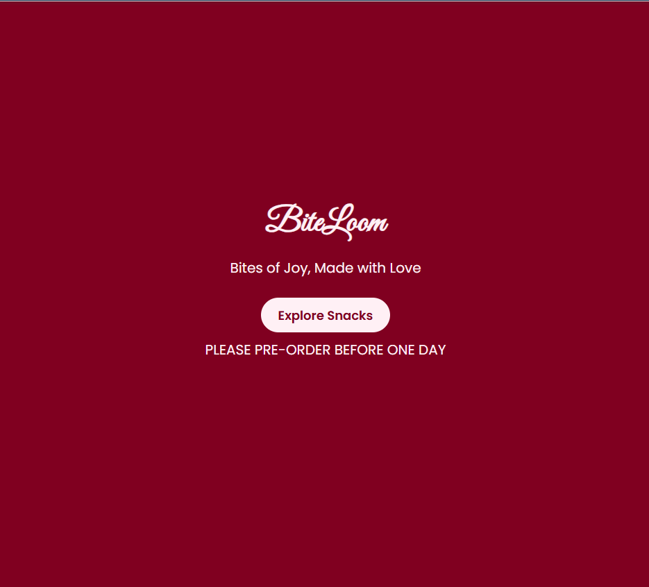
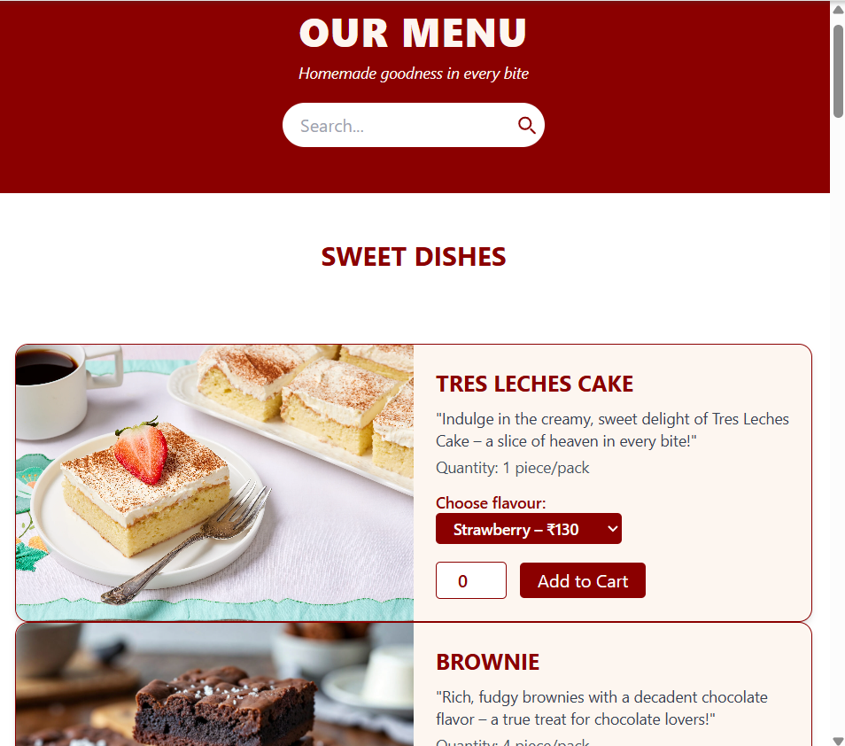
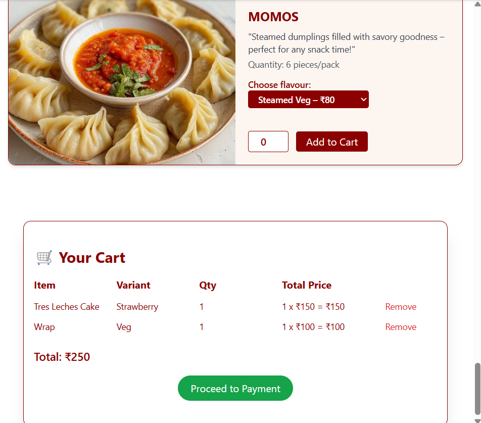
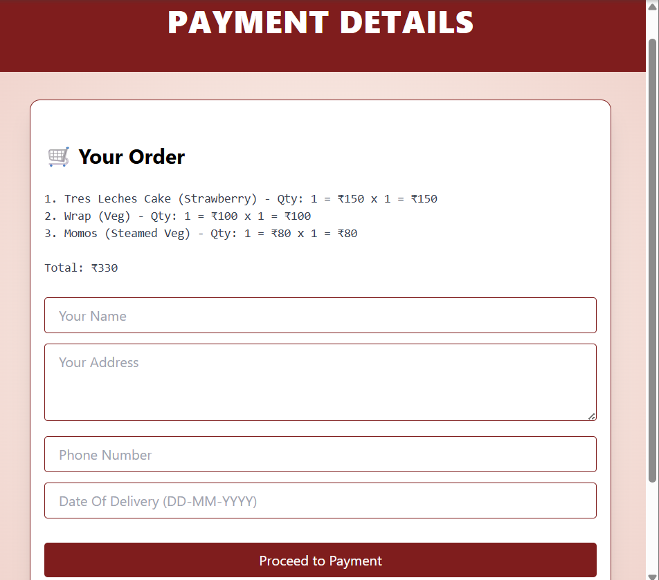

# Biteloom - Homemade Snacks Ordering Website

Biteloom is a cute, user-friendly snack ordering website built to showcase and sell homemade snack boxes with love. Customers can browse the menu, select quantities, and proceed to order easily — all wrapped in a soft, aesthetic design.

## Features

-  Browse delicious homemade snack boxes
-  Add items to cart with live quantity tracking
-  View descriptions and prices of each item
-  Search snacks by name or category
-  Proceed to a dynamic payment page with cart summary
-  Data persistence with localStorage

## 🖼️ Screenshots

Here’s a glimpse of the Biteloom user experience — soft, cute, and easy to use! 💕

| Home Page | Menu Page |
|-----------|-----------|
|  |  |

| Cart Page | Payment Page |
|-----------|--------------|
|  |  |

## Tech Stack

- HTML
- CSS 
- JavaScript
- Soft pastel UI theme (pink, lavender, grey)
- `localStorage` for saving cart and item quantities

## Project Structure
biteloom/
├── index.html # Main menu page
├── payment.html # Payment/cart page
├── styles.css # Custom styling
├── script.js # Main logic for cart and interaction
├── assets/ # Images, icons, logos
└── README.md # This file

## Getting Started

1. Clone the repo:
2. git clone https://github.com/Wasmia501/biteloom.git
cd biteloom

2. Open `index.html` in your browser to start using the site.

## Customization Ideas

- Add user login/signup
- Connect with payment gateways
- Backend for order management
- Admin dashboard to add/edit snacks

Biteloom is made to spread joy through homemade snacks and cute design. Built by Wasmia Naaz  to make snack shopping fun and easy!

